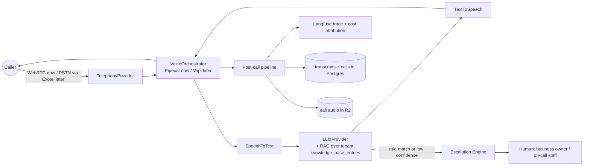
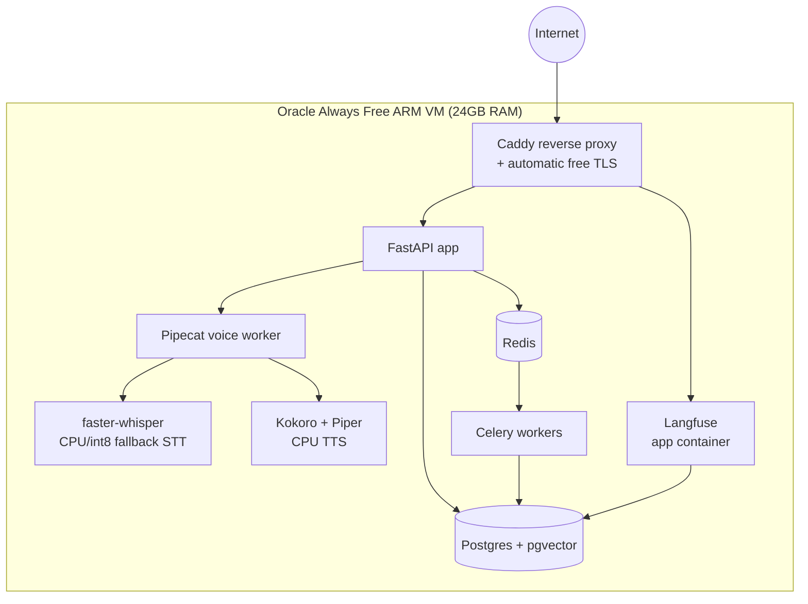

# Architecture

Technical architecture for Voice AI for Business. This is the detailed companion to the summary in `CLAUDE.md` — read that first for positioning, the full tech stack table, and the non-negotiable rules this document elaborates on.

> **Note on scope:** no application code exists in the repository yet. Everything below is the target design for the decided stack (see `CLAUDE.md` and `context/decisions.md`), to be corrected against reality as it's built — not retrofitted documentation of something already running.

---

## 1. System Overview

The canonical call path is expressed against the **abstraction interfaces** (§2), not against any one vendor — which vendor sits behind each box is resolved per-tenant at runtime from `agent_configs.cost_tier` (§12). Two concrete resolutions exist today:

- **Free tier (current default):** caller joins over **WebRTC** (no phone number) → **Pipecat** (self-hosted `VoiceOrchestrator`) → **Groq Whisper / faster-whisper** (`SpeechToText`) → **Groq or Cerebras LLM + pgvector RAG** over the tenant's knowledge base (`LLMProvider`) → **Kokoro / Piper** (`TextToSpeech`) → back to the caller.
- **Paid tier (deferred until a paying client funds it):** caller dials in over **Exotel** (`TelephonyProvider`) → **Vapi** (`VoiceOrchestrator`) → **Sarvam / Deepgram** (`SpeechToText`) → same LLM+RAG contract → **Sarvam / ElevenLabs** (`TextToSpeech`) → caller.

Both paths share the same escalation and post-call pipeline.



Every arrow into `TelephonyProvider`, `VoiceOrchestrator`, `SpeechToText`, and `TextToSpeech` is a call through our own interface — never a direct vendor SDK call. That's the whole point of §2.

---

## 2. Provider Abstraction Layer

**This is the most important section in this document.** Voice AI is a commodity; our product is the service wrapped around it. If the codebase is wired directly to Vapi or Sarvam, we have quietly become a Vapi/Sarvam reseller with no way to change vendors as pricing, quality, or India-specific support shifts. The abstraction layer is what keeps that from happening. It is also what makes the zero-budget stack survivable: every self-hosted, free-tier component we run today must be replaceable by a paid, higher-quality one **without touching a single call site**, the moment a client's revenue justifies it.

**Rule (see `CLAUDE.md` §Non-Negotiable Rules):** no file outside `src/providers/` may import a vendor SDK. All access goes through the interfaces below.

### Interfaces

```python
# src/providers/telephony/base.py
class TelephonyProvider(Protocol):
    async def place_outbound_call(self, to_number: str, *, tenant_id: str, call_context: dict) -> CallHandle: ...
    async def answer_inbound_call(self, call_sid: str) -> CallHandle: ...
    async def end_call(self, call_handle: CallHandle) -> None: ...
    # concrete: WebRTCTelephony (no-op / signaling only, today's default), ExotelTelephony, TwilioTelephony (deferred)

# src/providers/voice_orchestrator/base.py
class VoiceOrchestrator(Protocol):
    async def start_session(self, call_handle: CallHandle, *, agent_config: AgentConfig) -> VoiceSession: ...
    async def stream_audio_in(self, session: VoiceSession, chunk: bytes) -> None: ...
    async def stream_audio_out(self, session: VoiceSession) -> AsyncIterator[bytes]: ...
    async def end_session(self, session: VoiceSession) -> CallSummary: ...
    # concrete: PipecatOrchestrator (self-hosted, default), VapiOrchestrator (deferred), RetellOrchestrator (deferred)

# src/providers/stt/base.py
class SpeechToText(Protocol):
    async def transcribe_stream(self, audio: AsyncIterator[bytes], *, language: str) -> AsyncIterator[TranscriptChunk]: ...
    # concrete: GroqWhisperSTT (default primary), FasterWhisperSTT (self-hosted fallback / offline), SarvamSTT, DeepgramSTT (deferred)

# src/providers/tts/base.py
class TextToSpeech(Protocol):
    async def synthesize_stream(self, text: str, *, language: str, voice: str) -> AsyncIterator[bytes]: ...
    # concrete: KokoroTTS (English default), PiperTTS (Hindi/Hinglish default), SarvamTTS, ElevenLabsTTS (deferred)

# src/providers/llm/base.py
class LLMProvider(Protocol):
    async def complete(self, messages: list[Message], *, tools: list[Tool] | None = None) -> LLMResponse: ...
    async def embed(self, text: str) -> list[float]: ...
    # concrete: GroqLLM, CerebrasLLM (live-call default), GeminiFlashLLM (offline/analysis default), future paid LLMs
```

### Resolution

Every call site depends only on the `Protocol`, never on a concrete class. A `ProviderFactory`, given `agent_configs.cost_tier` + `agent_configs.language` + tenant, returns the concrete implementation:

```python
stt = provider_factory.get_stt(tenant_id)   # returns GroqWhisperSTT or SarvamSTT, caller doesn't know or care
```

Contract tests (one shared suite per interface, run against every concrete implementation — see `/new-provider` in `.claude/commands/commands.md`) guarantee every provider behind an interface behaves identically from the caller's point of view: same method signatures, same streaming semantics, same error types.

### Why this is non-negotiable

Vendor lock-in is an existential risk here specifically because **vendor choice is not our differentiation** — zero-effort onboarding, WhatsApp knowledge updates, escalation logic, and local trust are. If a client's needs outgrow the free-tier stack, or a vendor changes pricing, or an India-specific vendor becomes unavailable, we must be able to reconfigure one tenant's `cost_tier` and redeploy — not rewrite the product.

---

## 3. Data Model

`tenant_id` (FK to `tenants.id`) plus a Postgres Row Level Security policy exists on every table below except the two explicitly noted as partially global. RLS is not optional and is not "added later" — it ships with the first migration that creates each table.

| Table | Purpose | Key columns | Notes |
|---|---|---|---|
| `tenants` | one row per client business account | `id`, `name`, `vertical`, `created_at`, `status` | root of the tenant hierarchy |
| `businesses` | the tenant's actual business entity/location (a tenant may run >1 location) | `id`, `tenant_id`, `name`, `address`, `phone_numbers[]` | most tenants have exactly one; schema allows more |
| `knowledge_base_entries` | facts the agent can answer from, kept current via WhatsApp updates | `id`, `tenant_id`, `content`, `embedding vector(N)`, `source`, `confirmed_at`, `superseded_by` | pgvector index for RAG retrieval; `confirmed_at` NULL until the owner confirms (§4) |
| `agent_configs` | one row per agent *purpose* per tenant, not one row per tenant | `id`, `tenant_id`, `agent_type` (`inbound_care` \| `outbound_sales`), `vertical`, `language`, `cost_tier`, `prompt_version`, `escalation_rule_pack_id` | inbound care and outbound sales run on the same infra but have different goals, prompts, and often different `cost_tier`; see §12 |
| `calls` | one row per call, inbound or outbound | `id`, `tenant_id`, `agent_config_id`, `direction`, `from_number`, `to_number`, `started_at`, `ended_at`, `outcome`, `langfuse_trace_id` | `outcome` includes `escalated` |
| `transcripts` | full text transcript for a call | `id`, `tenant_id`, `call_id`, `turns jsonb`, `created_at` | personal data under DPDP — see §7 |
| `escalations` | a call (or moment in a call) handed to a human | `id`, `tenant_id`, `call_id`, `rule_id`, `reason`, `triggered_at`, `resolved_at`, `resolved_by` | `rule_id` references the escalation rule pack (§5) |
| `consent_records` | outbound-calling and WhatsApp consent per contact | `id`, `tenant_id`, `contact_phone_hash`, `consent_type`, `given_at`, `source`, `expires_at` | phone number stored hashed where the record only needs matching, not display |
| `dnd_list` | numbers that must never be called commercially | `id`, `tenant_id` (nullable), `phone_hash`, `source`, `added_at` | `tenant_id IS NULL` rows are the national TRAI DND registry (global, read-only to all tenants); non-null rows are a tenant's own opt-outs — RLS allows reading `tenant_id IS NULL OR tenant_id = current_tenant()` |

`knowledge_base_entries.embedding` is generated by `LLMProvider.embed()` (Gemini Flash today) — never a separate vector database (see rejected alternatives in `context/decisions.md`).

---

## 4. WhatsApp Update Ingestion Pipeline

The business owner's only "configuration" surface is WhatsApp. The pipeline exists specifically to prevent a garbled or ambiguous message from silently corrupting the knowledge base.

```
Owner sends WhatsApp message
        │
        ▼
Meta WhatsApp Cloud API webhook  →  our FastAPI webhook handler
        │
        ▼
LLMProvider structured extraction → strict JSON schema
  (e.g. {"type": "price_update", "item": "...", "old_value": "...", "new_value": "..."})
        │
        ▼
Confirmation message sent back to the owner
  ("Got it — updating consultation fee from ₹500 to ₹600. Reply YES to confirm.")
        │
        ▼
   ┌────┴────┐
   │ owner   │ confirms → write to knowledge_base_entries → re-embed → RAG index updated
   │ replies │
   │         │ owner corrects/declines → discard, do not write, optionally re-extract
   └─────────┘
```

**The confirmation step is mandatory and never bypassed.** No extracted update is written to `knowledge_base_entries` on extraction alone — only after an explicit owner confirmation reply. This is the single control standing between a misparsed WhatsApp message and an agent giving wrong information (or a wrong price) to a real customer; it does not get relaxed for latency, UX friction, or an owner's request to "just apply it automatically."

---

## 5. Escalation Engine

Two layers of rules run against every LLM turn during a call, evaluated on the live-call model (latency budget, §11):

1. **Per-vertical rule packs** (authored per `/new-vertical`, see `.claude/skills/skills.md`):
   - **Healthcare:** any symptom description, medication question, or emergency signal → immediate hard escalation. No confidence threshold, no exceptions — healthcare agents are admin-only (appointments, hours, billing) by design.
   - **Real estate:** price negotiation, legal/contract questions → escalate to a human agent.
   - **D2C / restaurant:** complaint or refund request → escalate.
   - **Education:** fee negotiation or waiver requests → escalate.
2. **Global uncertainty rule**, applied regardless of vertical: if the LLM's confidence in an answer is low (ambiguous knowledge-base match, out-of-scope question, contradictory retrieval results), the agent says it will confirm and get back to the caller, and the call is logged as `escalated` — it does not guess.

Rule packs are versioned per tenant/vertical (`agent_configs.escalation_rule_pack_id`) and validated against paired positive/negative transcript sets (see the escalation-rule-pack skill in `.claude/skills/skills.md`) so a prompt change can't silently disable a safety rule.

---

## 6. Outbound Calling Pipeline — ⛔ BLOCKED on DLT Registration

```
Lead/follow-up trigger → enqueue in Celery (Redis-backed)
        │
        ▼
   [DLT REGISTRATION GATE] ── not registered → REJECT, do not dial, log reason
        │ registered
        ▼
   Calling-window check (9 AM–9 PM IST) ── outside window → requeue for next window
        │ inside window
        ▼
   DND scrub (dnd_list, national + tenant) ── listed → REJECT, log reason
        │ not listed
        ▼
   Consent check (consent_records) ── no valid consent → REJECT, log reason
        │ consent present
        ▼
   Dial via TelephonyProvider → VoiceOrchestrator → ... (§1)
        │
        ▼
   Retry policy: bounded retries (e.g. no answer / busy) within the same day's
   calling window only, never carried into the next window without re-checking
   DND/consent state
```

**This entire path ships in a permanently failing-closed state until TRAI DLT Principal Entity registration exists.** The gate is real code, not a TODO or a feature flag defaulted to "on" — `dlt_registration_status` is checked from configuration/DB, and the default in the absence of a confirmed registration record is **block**, never **allow**. Registration is a paid prerequisite and is intentionally deferred (see `context/decisions.md`); the code must not assume it will be enabled by a config toggle someone forgets to flip. Every other check in this pipeline (calling window, DND, consent) exists independently of the DLT gate and stays enforced even after registration lands — DLT registration unblocks the queue, it does not replace the other checks.

---

## 7. Storage and Retention

- **Transcripts** — stored in Postgres indefinitely by default (needed for escalation review, prompt iteration, and dispute resolution), subject to the deletion-on-request flow below.
- **Call audio** — stored in Cloudflare R2, governed by a 30-day lifecycle rule (tightened from the general 30-90 day range to stay inside R2's 10GB free tier — see §13).
- **Deletion on request (DPDP):** a tenant or an end customer can request deletion of their personal data. This deletes the specific `transcripts` row(s) and the corresponding R2 audio object(s), and removes the contact's `consent_records`/`dnd_list` linkage as applicable, while calls/aggregate metrics (e.g. call counts for billing) may retain a de-identified record. Deletion is logged (who requested, when, what was removed) for compliance audit purposes.
- All of the above lives on India-region infrastructure only (§10) — no cross-border replication of personal data.

---

## 8. Observability

Every call gets a Langfuse trace (self-hosted) spanning the full pipeline: STT latency, retrieval hits, LLM prompt/completion (with token counts), TTS latency, and total round trip. Each trace carries **per-call cost attribution** — which concrete provider was used at each layer (resolved from `agent_configs.cost_tier`) and its cost for that call, rolling up into `/cost-report` (`.claude/commands/commands.md`). Sentry captures exceptions/crashes; PostHog captures product usage on the ops dashboard. None of the three receive raw PII (see the "no PII in logs" non-negotiable rule) — traces reference call/tenant IDs, not phone numbers or names.

---

## 9. Environments

There is currently one environment: the Oracle Cloud Always Free VM (§10), used for development, demos, and early design-partner calls alike — the team's zero-budget constraint doesn't currently support a separate staging/production split. Railway/Render (dev) with AWS ap-south-1 (production) was an earlier candidate plan; it is superseded by the Oracle VM decision and kept only as a documented rejected/reconsider-later alternative in `context/decisions.md`. If/when paid infrastructure is justified by revenue, migrating select components (e.g. a managed Postgres, or a proper staging environment) is a config/deployment change, not an architecture change, because of the provider abstraction layer (§2) and the fact that the app itself is already a portable Docker Compose stack (§10).

---

## 10. Deployment Topology

A single Oracle Cloud **Always Free** ARM VM (4 core, 24GB RAM, 200GB disk, Mumbai or Hyderabad region — chosen for DPDP data residency, §7) runs one Docker Compose stack:



**RAM budget (estimate, to be validated on first real deploy — not yet benchmarked):**

| Container | Est. RAM | Notes |
|---|---|---|
| Caddy | 0.1 GB | reverse proxy + TLS only |
| FastAPI app | 1.0 GB | |
| Pipecat voice worker | 2.0 GB | base cost; scales up with concurrent call count |
| faster-whisper (fallback STT) | 2.0 GB | int8 model resident in RAM |
| Kokoro + Piper (TTS) | 2.0 GB | both models loaded together |
| Postgres + pgvector | 3.0 GB | shares this instance with Langfuse's metadata DB rather than running Langfuse's own DB stack, to save RAM |
| Redis | 0.5 GB | |
| Celery workers | 1.5 GB | 2 worker processes |
| Langfuse app | 1.0 GB | Postgres-only trace storage, no separate ClickHouse — trades some Langfuse UI features for RAM headroom |
| **Subtotal** | **~13.1 GB** | |
| OS + Docker overhead + headroom for concurrent calls | ~10.9 GB | leaves real headroom before the 24GB ceiling is a concern |

**ARM (aarch64) constraint:** the Oracle VM is Ampere ARM, not x86. Every image — base images, and anything we build — must have an arm64 build. Official images we depend on (`postgres`, `redis`, `caddy`, `python:3.12-slim`) are multi-arch and fine. The risk sits in ML dependencies: `faster-whisper`'s `ctranslate2` backend and Kokoro/Piper's ONNX runtime must have prebuilt aarch64 wheels, or be built from source on first deploy — **verify wheel availability before committing to this image**, don't assume x86-tested instructions port cleanly. `faster-whisper` runs with `compute_type="int8"` and Kokoro runs CPU-only — there is no GPU on this VM, so no CUDA-dependent code path may be introduced anywhere in the stack.

---

## 11. Latency Budget

Target end-to-end round trip on the **free-tier, self-hosted** path (VAD → STT → retrieval → LLM → TTS → playback):

| Stage | Estimate | Notes |
|---|---|---|
| VAD / turn-end detection | 100-200 ms | Pipecat-side endpointing |
| STT | 200-400 ms (Groq) / 400-700 ms (faster-whisper fallback) | network + inference; fallback path is CPU-bound and slower |
| Retrieval (pgvector) | 20-50 ms | local, same VM as the app |
| LLM | 150-400 ms | Groq/Cerebras, chosen specifically for latency |
| TTS | 300-600 ms | Kokoro/Piper, CPU synthesis |
| Playback / network buffering | 100-200 ms | |
| **Total** | **~1.2-2.0 s** | matches the documented tradeoff in `context/decisions.md` |

**When budget appears, upgrade in this order:**

1. **Paid STT first.** The self-hosted fallback path (faster-whisper on CPU) is the single largest and most variable hop, especially whenever the Groq free tier is rate-limited and traffic spills onto it. A dedicated paid STT API (Sarvam/Deepgram) removes the CPU-bound tail latency entirely.
2. **Paid TTS second.** Kokoro/Piper are already reasonably fast, but ElevenLabs/Sarvam TTS trims further tail latency and improves prosody — a smaller win than STT, but the next-best single swap.

LLM is deliberately left for last: Groq/Cerebras free tier already runs on purpose-built low-latency inference hardware, so a paid LLM swap buys comparatively little on latency (it would be chosen for capability, not speed, and live calls prioritize speed).

---

## 12. Cost-Tier Configuration

`agent_configs.cost_tier` (`free` \| `standard` \| `premium`) is resolved by the `ProviderFactory` (§2) into concrete provider implementations — changing a tenant's tier is a config update, not a code change or redeploy of business logic.

| `cost_tier` | Telephony | Voice orchestration | STT | TTS | LLM (live) | When used |
|---|---|---|---|---|---|---|
| `free` | WebRTC only | Pipecat (self-hosted) | Groq (primary) / faster-whisper (fallback) | Kokoro (EN) / Piper (HI) | Groq / Cerebras | default — demos, design partners, pre-revenue tenants |
| `standard` | Exotel/Twilio (real phone number, billed to tenant) | Pipecat (self-hosted) | Groq / faster-whisper | Kokoro / Piper | Groq / Cerebras | first paying clients who need a real phone number but not premium voice quality |
| `premium` | Exotel/Twilio | Vapi | Sarvam / Deepgram | Sarvam / ElevenLabs | paid LLM (as needed) | clients paying for lowest latency / highest voice fidelity |

This table is the concrete instantiation of §1's two paths, plus the realistic middle step (`standard`) most early clients actually need first: a real phone number, not necessarily premium voice quality.

---

## 13. Free-Tier Guardrails

**Rate-limit / quota exhaustion mid-call:** every free-tier API call (Groq STT/LLM, Cerebras, Gemini Flash) is wrapped with quota/HTTP 429 detection. On exhaustion, the `ProviderFactory` fails over to the self-hosted local equivalent for the remainder of that call — `faster-whisper` for STT — rather than dropping the call. A short circuit breaker (mark the exhausted provider "cooling down" for N seconds) prevents repeatedly retrying a dead API mid-call, which would itself add latency on top of the outage. TTS has no failover concern since Kokoro/Piper are already self-hosted defaults, not the fallback.

**R2 free-tier ceiling (10GB):** the 30-day lifecycle rule (§7) is the primary control, but as tenant count grows, cumulative audio could approach 10GB before 30 days elapse. A scheduled Celery beat job checks total bucket usage and, if it crosses a warning threshold (e.g. 80%), raises a Sentry alert and — if it continues climbing — can drop stored audio for older calls while retaining the transcript (transcripts are the compliance-relevant record for dispute resolution; audio is a nice-to-have for QA) rather than silently failing uploads or blowing past the free tier into paid R2 usage.

---

## See Also

- `CLAUDE.md` — tech stack table, non-negotiable rules, positioning.
- `context/decisions.md` — why each rejected alternative (managed DB, paid voice platform as default, Railway/Render+AWS, etc.) was rejected, and the documented latency tradeoff.
- `context/coding-rules.md` — conventions for implementing the above once code exists.
- `.claude/skills/skills.md` — the prompt-writing, escalation-rule-design, provider-addition, and compliance-review procedures referenced throughout this document.
